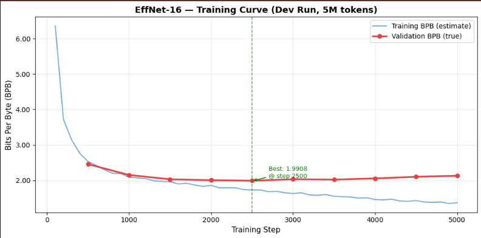

# Parameter Golf — OpenAI Model Craft Challenge

> Co-designed tiny language model optimised for bits-per-byte 
> compression under strict size and training constraints.

---

## Challenge Constraints

| Constraint | Limit |
|---|---|
| Model + code size | ≤ 16MB |
| Training time | ≤ 10 minutes on 8×H100 |
| Dataset | FineWeb (fixed) |
| Metric | Bits per byte (BPB) — lower is better |

---

## Development Results

| Run | Dataset | Steps | Best Val BPB | Notes |
|---|---|---|---|---|
| Run 1 | FineWeb 5M tokens | 5,000 | 1.9908 | Overfitting after step 2500 |
| Run 2 | FineWeb 50M tokens | 10,000 | **1.6797** | Still improving at final step |

> Model size: 13.58 MB  (under 16MB limit)
> Parameters: 18,982,272
> Best checkpoint: step 10000 (Run 2)




---

## Architecture — EffNet-16

| Component | Choice | Reason |
|---|---|---|
| Tokenisation | Byte-level, vocab 1024 | No external tokeniser |
| Layers | 12 | Depth beats width at tiny scale |
| Hidden dim | 384 | Fits 16MB at INT6 |
| Attention | 8 heads, 4 KV (GQA) | Half cost, near-full quality |
| MLP expansion | 2.5× (960 dim) | Novel lever — frees budget |
| Weight tying | Yes | Free compression |
| Positional enc | RoPE | Zero parameters |
| Quantisation | INT6 QAT + STE | Sweet spot for tiny models |

---

## Core Hypotheses

1. **Co-design advantage** — jointly optimising architecture, 
   quantisation, and training objective outperforms sequential 
   optimisation at equivalent parameter budgets
2. **Short training as a feature** — 10-minute constraint 
   makes weights naturally robust to aggressive quantisation
3. **MLP ratio as a design lever** — 2.5× expansion frees 
   parameter budget for depth without sacrificing performance

---

## Repository Structure
```
parameter-golf/
├── outputs/
│   ├── config.json          # model configuration
│   ├── training_log.json    # BPB at each eval checkpoint
│   ├── training_curve.png   # training vs validation BPB
│   └── effnet16_final.pt    # trained model weights
├── train.py                 # training script (coming)
├── run.sh                   # execution script (coming)
└── README.md
```

---

## About This Project

This submission is part of a structured learning project. 
I'm early-stage data science learner from 
Nigeria building real research skills through a live 
competition covering literature review, architecture 
design, experimental methodology, implementation, and 
academic writing in parallel.

